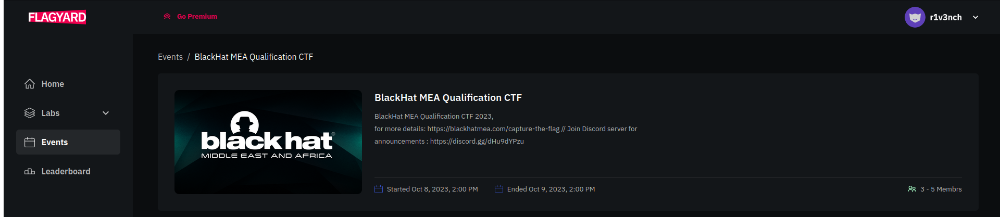

# BlackHat MEA Qualification CTF 2k23 Write-Ups

Welcome to BlackHat MEA Qualification CTF 2k23 Challenges' Write-Ups Repository, you can find all detailed solutions of each ctf's challenge.

## Introduction 

Black Hat MEA in collaboration with Saudi Federation for Cybersecurity, Programming & Drones (SAFCSP) will host a Capture The Flag Tournament, with over 1,000 participants entering the final stages at different levels of competency: amateur, intermediate, and expert, to help strengthen their ethical hacking skills. Year two will see the capture the flag competition run as a jeopardy-style competition both in the qualification and final stages. 

## Content

 - [Cryptography](./crypto/)
 - [Reverse Engineering](./reverse/)
 - [Web Exploitation](./web/)
