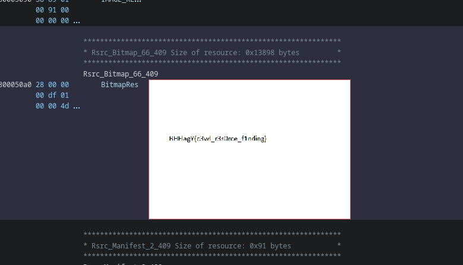

# What Am I ?

## Description

> Can you figure out what type of file this is?!?

## Write-Up

After unzipping the sources, we get a dll file type :

```
PE32+ executable (DLL) (GUI) x86-64, for MS Windows
```

But after open it with ghidra, we find an image all down :




## Flag

BHFlagY{c3wl_r3s0rce_f1nding}